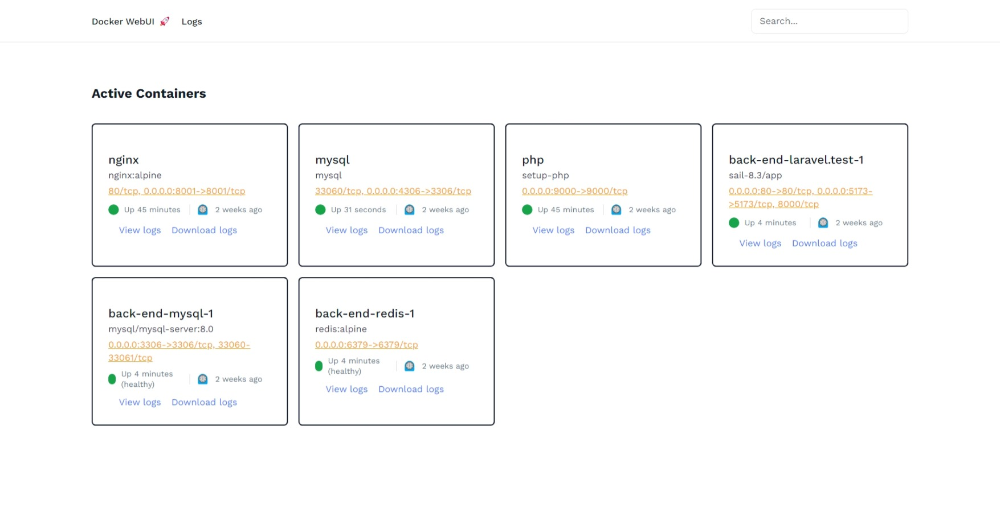

# Docker web-ui log-viewer

This AdonisJS web-ui based application allows you to visualize Docker container logs.



## Prerequisites

- Node.js
- [AdonisJS](https://adonisjs.com)
- Docker

## Installation

1. Clone the repository.
2. Install dependencies with `npm install`.
3. Rename the .env.example file to .env
4. Generate a key by typing the command: `node ace generate:key`.

## Configuration

1. Ensure Docker is installed and running on your machine.
2. Configure Docker access if necessary.

## Usage

1. Run the AdonisJS development server with `node ace serve`.
2. Access the corresponding URL to view container information (`/logs`) or logs from a specific container (`/logs/:id/view`).

## Deploiement

```sh
cd build
npm ci --omit="dev"
node bin/server.js
```

## Project Structure

- **app/Controllers/logs_controller.ts**: Primary controller for Docker logs management.
- **resources/views/logs/index.edge**: View to display active containers information.
- **resources/views/logs/view.edge**: View to display logs from a specific container.
